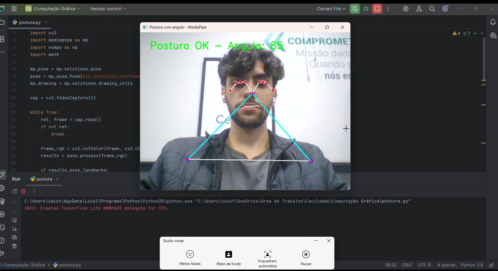
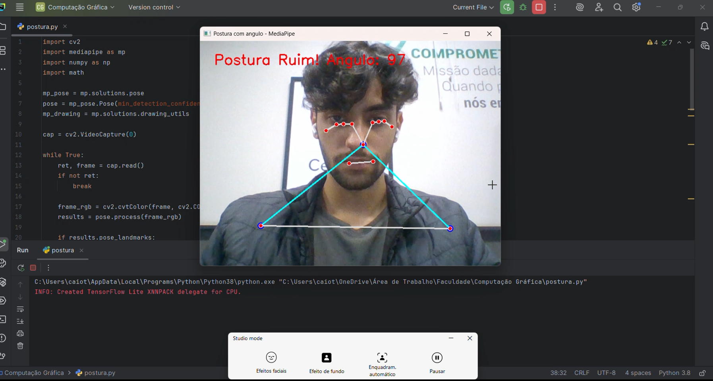

# Monitoramento de Postura - Python

Este projeto utiliza **Visão Computacional** e **Inteligência Artificial** para analisar, em tempo real, a **postura do usuário capturada pela webcam**, com base no ângulo entre o nariz e os ombros. O sistema classifica a postura como "OK" ou "Ruim" com base no cálculo geométrico do ângulo entre os vetores formados pelos ombros e o nariz.

---

## 📌 Funcionalidades

- Captura de vídeo em tempo real com `OpenCV`.
- Detecção de pose com `MediaPipe`.
- Cálculo do ângulo entre os ombros e o nariz.
- Feedback visual sobre a qualidade da postura.
- Anotação da imagem com landmarks e vetores.

---

## 💡 Tecnologias Utilizadas

- **Python 3.7+**
- **OpenCV** – Captura e exibição de vídeo.
- **MediaPipe Pose** – Detecção de 33 pontos do corpo humano em tempo real.
- **NumPy** – Cálculo de vetores e ângulos.
- **Math** – Funções matemáticas para conversão de ângulo.

---

## ⚙️ Instalação

1. Clone o repositório:

```bash
git clone https://github.com/caiotaveiraa/verificador-postura.git
cd verificador-postura
cd Postura
```

2. Instale as dependências:

```bash
pip install opencv-python mediapipe numpy
```

3. Execute o script:

```bash
python postura.py
```

---

## 🧠 Técnicas de IA Utilizadas

Este projeto utiliza o **MediaPipe Pose**, um modelo baseado em **Machine Learning** da Google, para identificar automaticamente os pontos-chave (landmarks) do corpo humano, como ombros, nariz, quadris etc.

### 🧮 Como funciona o cálculo:

- São extraídos os pontos do **nariz**, **ombro esquerdo** e **ombro direito**.
- Calcula-se o **ângulo** entre os vetores `nariz → ombro esquerdo` e `nariz → ombro direito`.
- Se o ângulo for maior que **90 graus**, a postura é considerada **ruim**.

---

## 📸 Imagens da Aplicação

### ✅ Postura Correta


### ❌ Postura Incorreta


---

## 🎥 Vídeo Demonstrativo


---

## 👨‍🎓 Desenvolvido por

**Caio Taveira - 23947**
